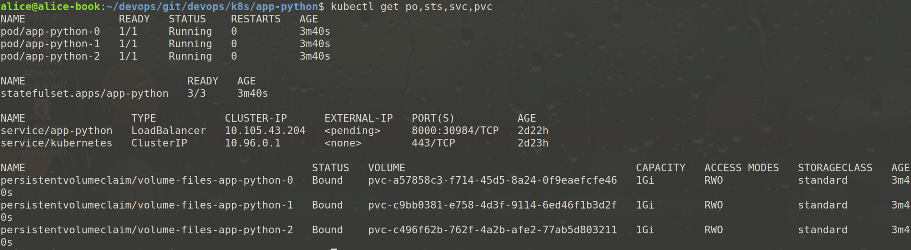
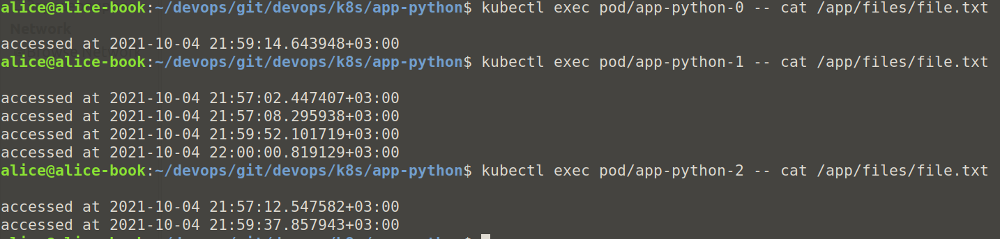

Output of `kubectl get po,sts,svc,pvc`

\
Check the content of file, in each pod

By default pods in StatefulSet are unique and may have unique state. Since we did not synchronize them, we can see that content of the file in each pod is different.

\
For our app ordering guarantee are unnecessary because pods do not depend on each other.

\
To tell to the StatefulSet controller to launch or terminate all Pods in parallel we use Pod Management Policy: `podManagementPolicy: Parallel`