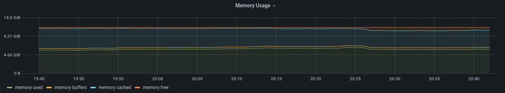
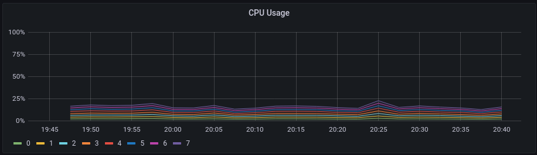
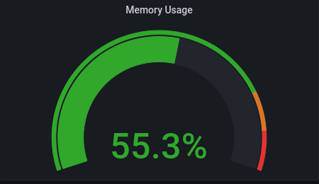
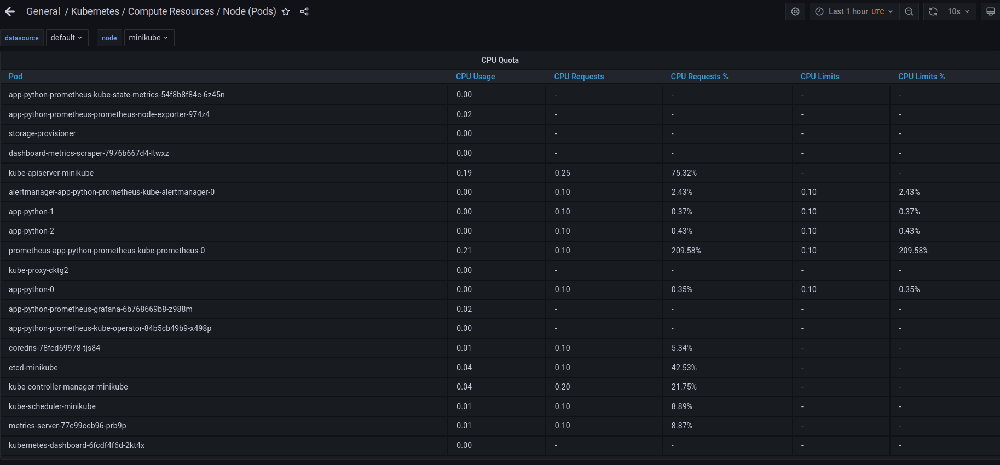
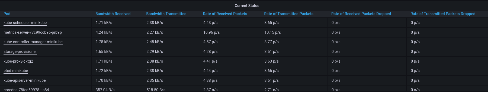
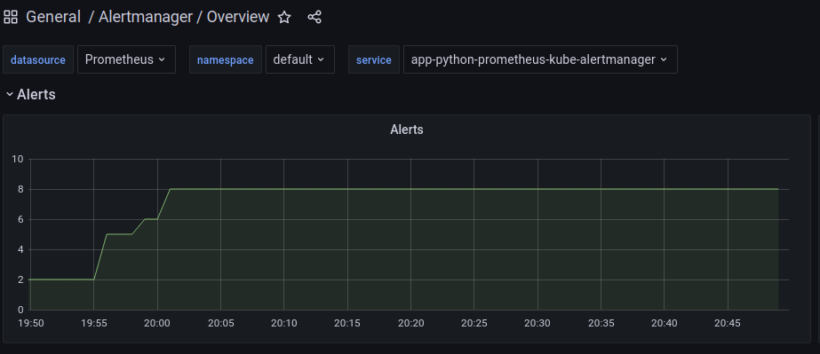

#### Prometheus Operator

Assist kubernetes with deployment, management of Prometheus and monitoring.

#### Prometheus

Tool to collect and store metrics.

#### Alertmanager

Tool to handle alerts from client applications.

#### Prometheus node-exporter

Tool to handle statistics from the hardware and OS

#### Prometheus Adapter for Kubernetes Metrics APIs

#### kube-state-metrics

Tool that listens to the Kubernetes API server and generates metrics about the state of the objects.

#### Grafana

Tool to display metrics from prometheus

See information about pods, statefulsets, services, volumes, configmaps:
```
$ alice@alice-book:~/devops/git/devops/k8s/app-python$ kubectl get po,sts,svc,pvc,cm
NAME                                                            READY   STATUS    RESTARTS   AGE
pod/alertmanager-app-python-prometheus-kube-alertmanager-0      2/2     Running   0          7m29s
pod/app-python-0                                                1/1     Running   0          56s
pod/app-python-1                                                1/1     Running   0          61s
pod/app-python-2                                                1/1     Running   0          66s
pod/app-python-prometheus-grafana-6b768669b8-z988m              2/2     Running   0          7m47s
pod/app-python-prometheus-kube-operator-84b5cb49b9-x498p        1/1     Running   0          7m47s
pod/app-python-prometheus-kube-state-metrics-54f8b8f84c-6z45n   1/1     Running   0          7m47s
pod/app-python-prometheus-prometheus-node-exporter-974z4        1/1     Running   0          7m48s
pod/prometheus-app-python-prometheus-kube-prometheus-0          2/2     Running   0          7m27s

NAME                                                                    READY   AGE
statefulset.apps/alertmanager-app-python-prometheus-kube-alertmanager   1/1     7m29s
statefulset.apps/app-python                                             3/3     92m
statefulset.apps/prometheus-app-python-prometheus-kube-prometheus       1/1     7m27s

NAME                                                     TYPE           CLUSTER-IP      EXTERNAL-IP   PORT(S)                      AGE
service/alertmanager-operated                            ClusterIP      None            <none>        9093/TCP,9094/TCP,9094/UDP   7m29s
service/app-python                                       LoadBalancer   10.105.43.204   <pending>     8000:30984/TCP               3d
service/app-python-prometheus-grafana                    ClusterIP      10.108.47.24    <none>        80/TCP                       7m48s
service/app-python-prometheus-kube-alertmanager          ClusterIP      10.98.10.187    <none>        9093/TCP                     7m48s
service/app-python-prometheus-kube-operator              ClusterIP      10.111.27.152   <none>        443/TCP                      7m48s
service/app-python-prometheus-kube-prometheus            ClusterIP      10.97.234.51    <none>        9090/TCP                     7m48s
service/app-python-prometheus-kube-state-metrics         ClusterIP      10.104.2.82     <none>        8080/TCP                     7m48s
service/app-python-prometheus-prometheus-node-exporter   ClusterIP      10.107.81.163   <none>        9100/TCP                     7m48s
service/kubernetes                                       ClusterIP      10.96.0.1       <none>        443/TCP                      3d1h
service/prometheus-operated                              ClusterIP      None            <none>        9090/TCP                     7m27s

NAME                                              STATUS   VOLUME                                     CAPACITY   ACCESS MODES   STORAGECLASS   AGE
persistentvolumeclaim/volume-files-app-python-0   Bound    pvc-a57858c3-f714-45d5-8a24-0f9eaefcfe46   1Gi        RWO            standard       92m
persistentvolumeclaim/volume-files-app-python-1   Bound    pvc-c9bb0381-e758-4d3f-9114-6ed46f1b3d2f   1Gi        RWO            standard       92m
persistentvolumeclaim/volume-files-app-python-2   Bound    pvc-c496f62b-762f-4a2b-afe2-77ab5d803211   1Gi        RWO            standard       92m

NAME                                                                     DATA   AGE
configmap/app-python-prometheus-grafana                                  1      7m49s
configmap/app-python-prometheus-grafana-config-dashboards                1      7m49s
configmap/app-python-prometheus-grafana-test                             1      7m49s
configmap/app-python-prometheus-kube-alertmanager-overview               1      7m49s
configmap/app-python-prometheus-kube-apiserver                           1      7m49s
configmap/app-python-prometheus-kube-cluster-total                       1      7m49s
configmap/app-python-prometheus-kube-controller-manager                  1      7m49s
configmap/app-python-prometheus-kube-etcd                                1      7m49s
configmap/app-python-prometheus-kube-grafana-datasource                  1      7m49s
configmap/app-python-prometheus-kube-k8s-coredns                         1      7m49s
configmap/app-python-prometheus-kube-k8s-resources-cluster               1      7m49s
configmap/app-python-prometheus-kube-k8s-resources-namespace             1      7m49s
configmap/app-python-prometheus-kube-k8s-resources-node                  1      7m49s
configmap/app-python-prometheus-kube-k8s-resources-pod                   1      7m49s
configmap/app-python-prometheus-kube-k8s-resources-workload              1      7m49s
configmap/app-python-prometheus-kube-k8s-resources-workloads-namespace   1      7m49s
configmap/app-python-prometheus-kube-kubelet                             1      7m49s
configmap/app-python-prometheus-kube-namespace-by-pod                    1      7m49s
configmap/app-python-prometheus-kube-namespace-by-workload               1      7m49s
configmap/app-python-prometheus-kube-node-cluster-rsrc-use               1      7m49s
configmap/app-python-prometheus-kube-node-rsrc-use                       1      7m49s
configmap/app-python-prometheus-kube-nodes                               1      7m49s
configmap/app-python-prometheus-kube-persistentvolumesusage              1      7m49s
configmap/app-python-prometheus-kube-pod-total                           1      7m49s
configmap/app-python-prometheus-kube-prometheus                          1      7m49s
configmap/app-python-prometheus-kube-proxy                               1      7m49s
configmap/app-python-prometheus-kube-scheduler                           1      7m49s
configmap/app-python-prometheus-kube-statefulset                         1      7m49s
configmap/app-python-prometheus-kube-workload-total                      1      7m49s
configmap/config                                                         1      3d
configmap/kube-root-ca.crt                                               1      17d
configmap/prometheus-app-python-prometheus-kube-prometheus-rulefiles-0   28     7m28s
```














