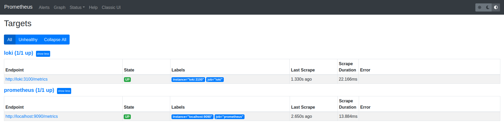

## Logging best practices

* Write meaningfull log messages

* Use static labels to make it easier to query your logs in a logical sens

* Set memory usage limit

## Logging

Loki shows logs by container id. 

\
Targets dashboard

\
Dashboard in Grafana for Loki

\
Dashboard in Grafana for Prometheus

